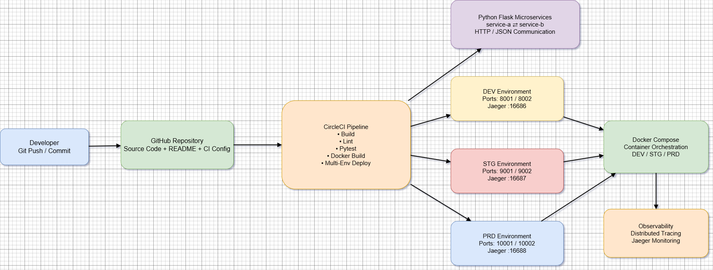

# Projeto Final DevOps — Microsserviços Python e Entrega Contínua

# Projeto Final DevOps — Microsserviços Python e Entrega Contínua



Projeto com dois microsserviços Flask (`service-a` e `service-b`), três ambientes (`DEV`, `STG`, `PRD`) com Docker Compose, pipeline no CircleCI e tracing distribuído com Jaeger.

---

## Resumo do que foi implementado

- **Arquitetura:** diagrama em Draw.io + PNG em `docs/`.
- **Microsserviços:** comunicação HTTP/JSON entre `service-a` e `service-b`.
- **Orquestração:** `docker-compose.yml` com stacks `DEV`, `STG` e `PRD`.
- **CI:** `.circleci/config.yml` com build e testes automatizados para os 3 ambientes.
- **Testes:** `pytest` para ambos os serviços.
- **Observabilidade:** Jaeger ativo em cada ambiente.
- **Python env:** uso de `venv` e `requirements.txt` (raiz e por serviço).

---

## Estrutura principal do projeto

```text
devops-microservices-project/
├── .circleci/config.yml
├── docker-compose.yml
├── Makefile
├── requirements.txt
├── docs/
│   ├── 20260518-HLD-ProjetoFinal-DevOps.drawio
│   └── 20260518-HLD-ProjetoFinal-DevOps.drawio.png
└── microservices/
    ├── service-a/
    │   ├── app.py
    │   ├── test_app.py
    │   ├── requirements.txt
    │   └── Dockerfile
    └── service-b/
        ├── app.py
        ├── test_app.py
        ├── requirements.txt
        └── Dockerfile
```

---

## Como executar (Ubuntu WSL / Git Bash)

### 1) Subir tudo

```bash
make start
```

Endpoints:

- DEV: `http://localhost:8001`, `http://localhost:8002`, Jaeger `http://localhost:16686`
- STG: `http://localhost:9001`, `http://localhost:9002`, Jaeger `http://localhost:16687`
- PRD: `http://localhost:10001`, `http://localhost:10002`, Jaeger `http://localhost:16688`

### 2) Ver estado

```bash
make status
```

### 3) Executar testes

```bash
make test
```

### 4) Pipeline local completa

```bash
make pipeline
```

### 5) Limpeza final

```bash
make stop
make clean
```

---

## Evidência objetiva (última validação)

Comandos executados com sucesso no projeto:

- `make clean`
- `make start`
- `make status`
- `make test`
- `make build`
- `make pipeline`

Resultado dos testes:

- `service-a`: **3 passed**
- `service-b`: **15 passed**
- Repetido com sucesso em **DEV/STG/PRD**

---

## Pipeline remota (CircleCI)

Após `make start`/`push`, acompanha o estado aqui:

- [CircleCI pipelines - querinoz](https://app.circleci.com/pipelines/github/querinoz)

